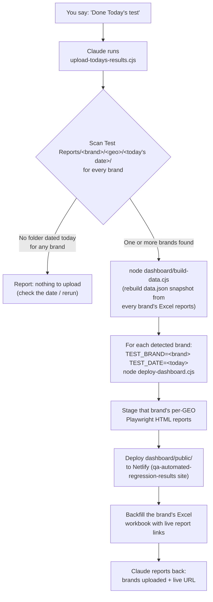

# Auto-Upload System — "Done Today's test"

This explains how the automatic Netlify upload works when you tell Claude
**"Done Today's test"**. You don't need to name a brand, run any commands, or
remember any file paths — Claude figures all of that out from what's actually
on disk.

## What it does, in plain terms

When you finish running one or more brands through the GUI for the day and
tell Claude "Done Today's test," it:

1. Looks at what actually got tested today (by checking the report folders
   the test run itself created — nothing needs to be typed or selected).
2. Refreshes the results website's data so it reflects today's numbers.
3. Uploads the overview page, plus the detailed report for every brand/country
   tested today, to the shared Netlify site.
4. Tells you what got uploaded and gives you the link.

If nothing was actually tested today (or the report hasn't finished writing
yet), it tells you that instead of silently doing nothing.

## How it works (technical)



### The pieces involved

| Piece | What it's for |
|---|---|
| `Test Reports/<brand>/<geo>/<date>/` | Where the GUI/CLI test run already writes its results — the automation reads this, it doesn't create it. |
| `upload-todays-results.cjs` | The new entry point for this trigger. Detects which brand(s) have a folder dated today, then drives the two scripts below for each one. |
| `dashboard/build-data.cjs` | Scans every brand's Excel report and rebuilds `dashboard/public/data.json` — the snapshot the results website actually reads (a static site can't reach into this machine's local folders on its own). |
| `deploy-dashboard.cjs` | Stages one brand's per-GEO Playwright HTML reports into `dashboard/public/reports/<brand>/<date>/`, deploys the whole `dashboard/public/` folder to Netlify, and links the results website's rows back to those staged reports. |
| Netlify site | `qa-automated-regression-results` (separate from the team's other report-hosting Netlify site) — this is the public-facing overview: total passed/failed, a trend chart, and links into each brand's real report. |

### Why brand detection instead of asking every time

The trigger phrase is meant to be a single sentence with nothing else to
remember — no brand name, no date, no flags. The report folders the test run
already writes are timestamped by date automatically, so scanning for
"what has a folder dated today" is a reliable stand-in for "what did I just
run" without needing you to repeat information the test run already recorded.

### What it does NOT do

- It does not touch git, GitHub, or `CHANGELOG.md` — that's the separate
  **Push Trigger** ("That's it for today"), covered in `CLAUDE.md`.
- It does not upload trace `.zip` files — only the video, screenshots, and
  HTML report, same as the team's other report-hosting deploy (see the
  "No trace upload to Netlify" decision).
- It does not delete or overwrite a previous day's uploaded reports — each
  day's reports are staged under their own date folder.

## First-time setup on a new machine (laptop, teammate's computer, etc.)

`git pull` gets you the code, but two things this trigger needs are
deliberately **not** in git — get both from Reeve before the first time you
run this on a new machine:

1. **`.env`** — needed for `NETLIFY_AUTH_TOKEN` (Dominik's Netlify account
   token this project deploys under).
2. **`dashboard/.netlify-site.json`** — remembers the *existing*
   `qa-automated-regression-results` site's ID. This one is easy to miss
   since nothing errors without it — but if it's missing, `deploy-dashboard.cjs`
   assumes no site exists yet and **creates a brand-new duplicate Netlify
   site** instead of updating the real one. Place it at exactly
   `dashboard/.netlify-site.json` (same relative path) before running the
   trigger for the first time on a new machine.

Both are gitignored on purpose (see `.gitignore`) — same reasoning as
`.env` itself: machine-specific/sensitive state that shouldn't live in git
history.

## Running it manually

If you ever want to trigger this yourself without going through Claude:

```
npm run upload-results
```

To upload results for a date other than today (e.g. you're catching up on
yesterday's run):

```
TEST_DATE=2026-09-09 node upload-todays-results.cjs
```
