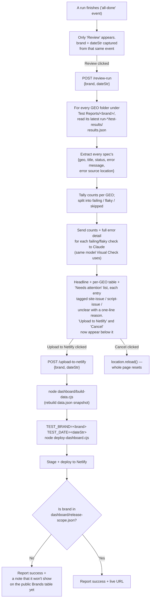

# "Review" and "Upload to Netlify" buttons (Results panel)

This explains how the Results panel's **Review** flow works — the only
button visible right after a run is "Review"; **Upload to Netlify** and
**Cancel** only appear once Review has actually run, sitting right below its
output, between "View report" and "Download Excel report."

## What it does, in plain terms

**Review** gives you an AI-written, plain-English headline of the run that
just finished, plus a **per-GEO table** (Total / Passed / Failed / Flaky /
Skipped) and a "Needs attention" list naming exactly which checks failed or
were flaky — without opening the Excel report or the raw HTML report
yourself, or asking Claude in chat to do it.

Each failing/flaky check in that list also gets a **site issue / script
issue / unclear** badge with a one-line reason, so you have a starting read
on whether it's a real product bug or a test-code problem before you decide
what to upload. **This is a script's best-effort guess, not a guaranteed
diagnosis** — see the "Is this actually reliable?" section below before
trusting it as-is for anything going into a tracker or Status field.

Once that's on screen, you get two choices:

- **Upload to Netlify** — publishes this run to the shared
  `qa-automated-regression-results.netlify.app` site, the same steps the
  **"Done Today's test"** chat trigger runs (see `docs/AUTO-UPLOAD-SYSTEM.md`),
  just scoped to the one brand/date that just finished instead of scanning
  for everything tested today.
- **Cancel** — backs all the way out. This reloads the whole page (a real
  browser reload, not just hiding the review panel), so the next thing you
  do starts from a genuinely clean slate.

Nothing here needs a brand name, date, or file path typed in — one click on
Review is all it takes to see what happened, then one more click to publish
it or walk away.

## How it works (technical)

### The pieces involved

| Piece | What it's for |
|---|---|
| `gui/server.ts` → `POST /review-run` | Reads real result data (including each failure's actual error message + source location), builds the per-GEO table, and calls Claude for the headline + a site-issue/script-issue verdict per failing/flaky check. Does no test-running itself. Returns `{summary, counts, geoBreakdown, failing, flaky}`, where each `failing`/`flaky` entry carries `{geo, title, errorMessage, classification, reasoning}`. |
| `gui/server.ts` → `POST /upload-to-netlify` | Runs the same two commands `upload-todays-results.cjs` runs by hand, for one brand/date. Only reachable once Review's output is on screen. |
| `Test Reports/<brand>/<geo>/<date>/run-<HH-MM-SS>/test-results/results.json` | Playwright's own raw per-run result file — Review reads this directly, one per GEO, always the most recently modified `run-*` folder for that date. |
| `dashboard/release-scope.json` | The human-curated allowlist of brands shown on the public Netlify overview. Upload does **not** edit this automatically (see below). |
| `gui/public/app.js` | Captures `brand`/`dateStr` from the `all-done` SSE event, renders the table/list from Review's response, and reveals Upload/Cancel only after that response comes back. |

### Why brand/date get captured from the `all-done` event

The run's session (which normally tracks brand/GEOs/dates while a run is
in progress) is deleted from the server the moment the run finishes — so by
the time you'd actually click Review (or, later, Upload), there's no session
left to ask. The `all-done` event that makes the Review button appear in
the first place is also the last moment the server knows brand/date for
certain, so it's included right there and the browser just holds onto it
for both requests.

### A real gotcha this caught: Playwright's status names

Playwright's JSON report doesn't use `"passed"`/`"failed"` on each test —
it uses **`"expected"`** (passed as expected), **`"unexpected"`** (a real
failure), **`"flaky"`** (failed at least once, then passed on a retry), and
**`"skipped"`**. The `"passed"`/`"failed"`/`"timedOut"` names only exist one
level deeper, per individual attempt, not on the test as a whole. Review's
failure-detection was built and tested against a real run with genuine
failures (not just a clean one) specifically because of this — a version
that checked the wrong names would show a clean-looking summary even when
real failures were sitting right there in the data.

### Is this actually reliable? Who's really doing the review?

**Short answer: it's a script, not a person.** `POST /review-run` is one
server-side call to the Anthropic API — not this Claude Code session, not
someone reading the actual failure live. It sees the failing check's real
error message and the file/line it came from, and makes an informed guess
from that alone. It does **not**:

- Open the live site to check what's actually there
- Compare against a reference brand's known-working behavior
- Read the test's surrounding code for context beyond the one error line
- Know about prior investigations already on file (this project's own
  memory of past bugs, `dashboard/known-issues.json`, etc.)

That's exactly the kind of work a real investigation took for several of
the bugs found in this project's history — reading source, running a live
browser, cross-checking a sibling brand. A single error message often
*strongly* suggests site vs. script (e.g. "0 elements found after 10s" on a
stable selector reads very differently from "timeout waiting for network
idle"), which is why the classification is usually a reasonable starting
point — but it can be wrong, and "unclear" is a real possible answer, not
just a fallback.

**Treat the badge as a first-pass triage, not a final verdict.** Spot-check
anything before it goes into `dashboard/known-issues.json`, a Jira ticket,
or any other place a human will trust the "site" vs. "script" call without
re-checking it themselves.

### What Upload does NOT do

- It does **not** add the brand to `dashboard/release-scope.json` on its
  own. That file is a deliberate, human-curated "this brand's current
  release cycle is real and should be public" decision (see its own header
  comment) — Upload stages and deploys the report files regardless, but if
  the brand isn't in that list yet, it tells you so instead of silently
  adding it.
- It does not touch git, GitHub, or `CHANGELOG.md` — same separation as the
  chat-based "Done Today's test" trigger.
- It does not require picking a GEO — it uploads every GEO that brand has a
  report for on that date, same as `deploy-dashboard.cjs` always has.

## If Review says "No test result data found"

That means it looked under `Test Reports/<brand>/<geo>/<date>/` for every
GEO and found no `run-*` folder with a readable `results.json` for that
date — usually because the run's report hasn't finished writing yet, or the
date genuinely doesn't have a run. It won't guess or fabricate a summary in
that case.

## If Upload succeeds but you don't see the brand on the live site

Check `dashboard/release-scope.json` — the note the button returns tells you
this directly, but the fix is manual on purpose: add the brand's code to the
`"brands"` array, then click Upload again (or run the two commands by hand,
same as `docs/AUTO-UPLOAD-SYSTEM.md` describes) so the rebuilt `data.json`
picks it up.
